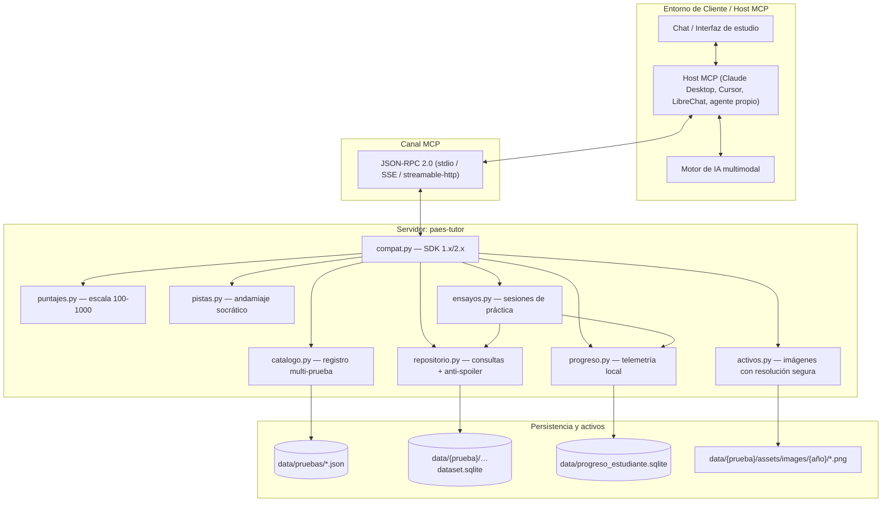
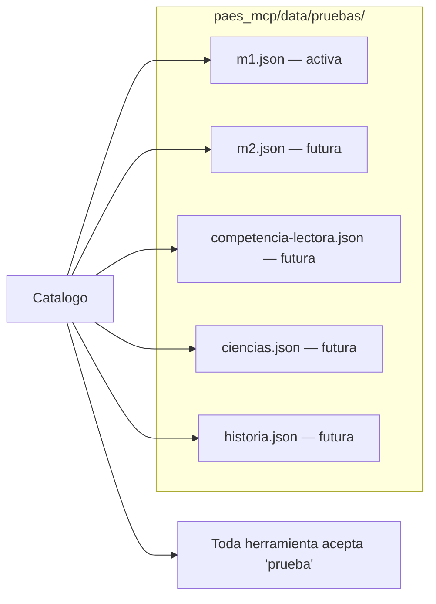
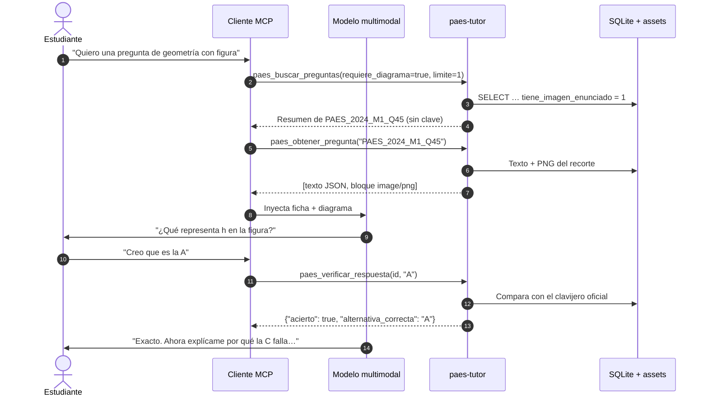

# Documento de Diseño Arquitectónico: Servidor MCP para Tutoría PAES

**Versión:** 2.0.0
**Estado:** Implementado (M1) · Extensible (resto de las pruebas)
**Alcance actual:** Matemática 1 (M1) — PAES, Chile
**Protocolo:** Model Context Protocol (MCP), SDK oficial de Python 1.x / 2.x
**Licencia del software:** MIT · **Procedencia del contenido:** publicaciones oficiales y gratuitas del DEMRE (ver [`AVISO_LEGAL.md`](AVISO_LEGAL.md))

---

## 0. Principios del proyecto

Estos principios mandan sobre cualquier decisión técnica posterior:

1. **Libre, abierto y gratuito.** Código MIT, sin costo, sin cuentas, sin
   publicidad, sin funciones bloqueadas.
2. **Sin telemetría.** El progreso del estudiante vive en un SQLite local. El
   servidor no hace llamadas de red.
3. **Origen oficial y verificable.** Todo el material proviene de publicaciones
   oficiales, públicas y gratuitas del DEMRE, con trazabilidad ítem a ítem
   (fuente, forma, número y página del PDF original). Nada de preuniversitarios,
   editoriales ni solucionarios de terceros.
4. **Honestidad epistémica.** Cada salida declara si es material oficial, dato
   derivado (heurístico) o andamiaje generado. **Nunca se inventan tablas
   oficiales ni se presentan estimaciones como si fueran datos del DEMRE.**
5. **Respeto por la titularidad ajena.** Las pruebas son obra del DEMRE /
   Universidad de Chile; el proyecto no reclama derechos sobre ellas, las cita
   con atribución y atiende solicitudes de retiro.
6. **Multi-prueba desde el diseño.** M1 es la primera prueba, no la única
   posible: agregar otra es declarativo, no requiere tocar el código.

---

## 1. Visión y objetivos

### 1.1. Problema

Estudiar la PAES conversando con un LLM sin infraestructura dedicada falla de
tres maneras estructurales:

1. **Alucinación en la corrección.** El modelo resuelve el ítem al vuelo; si se
   equivoca, corrige mal al estudiante y le enseña procedimientos errados.
2. **Spoiler inmediato.** El modelo entrega la solución completa apenas se le
   muestra el enunciado, anulando el proceso de deducción.
3. **Ceguera multimodal.** Una fracción grande de M1 son figuras, tablas,
   gráficos de barras y diagramas de caja (en el dataset actual, 68 de 155
   ítems traen diagrama de enunciado). Un tutor de solo texto queda inhabilitado.

### 1.2. Solución

Un servidor MCP, `paes-tutor`, que **desacopla la fuente de verdad** (dataset
oficial, recortes visuales y clavijero) **del motor de IA**, y actúa como
mediador pedagógico:

- Sirve preguntas **sin filtrar la clave** (diseño anti-spoiler).
- Entrega los diagramas como contenido multimodal para razonamiento visual.
- Corrige **de forma determinista** contra el clavijero oficial.
- Provee andamiaje socrático graduado en lugar de resoluciones.
- Convierte puntaje bruto a escala 100-1000 **declarando su estatus**.
- Registra progreso y errores localmente para repetición espaciada.

---

## 2. Arquitectura



### 2.1. Módulos

| Módulo | Responsabilidad |
| :--- | :--- |
| `config.py` | Rutas y opciones por variables de entorno; funciona sin configuración. |
| `catalogo.py` | Carga las especificaciones de prueba desde JSON. **Pieza multi-prueba.** |
| `repositorio.py` | Consulta facetada de solo lectura; la clave solo sale por `clave_oficial()`. |
| `ejes.py` | Clasificación temática heurística (declarada como tal). |
| `activos.py` | Resolución segura de rutas de imagen (rechaza salir del árbol de assets). |
| `puntajes.py` | Tabla oficial si existe; si no, interpolación marcada como estimada. |
| `pistas.py` | Andamiaje por nivel y eje; **no consulta la clave**. |
| `progreso.py` | Intentos, bitácora de errores y sesiones, en SQLite local. |
| `ensayos.py` | Modalidades de práctica, incluida la focalizada por debilidades. |
| `plantillas.py` | Prompts pedagógicos. |
| `compat.py` | Abstrae `FastMCP` (SDK 1.x) y `MCPServer` (SDK 2.x). |
| `server.py` | Registro de tools, resources y prompts; traducción de errores. |

### 2.2. Estructura del repositorio

El código y el contenido viven separados: `paes_mcp/` es el servidor, `data/` es
el material de estudio, y ninguna prueba ensucia la raíz.

```
paes_mcp/
├── data/pruebas/*.json      definiciones declarativas de prueba (multi-prueba)
├── data/puntajes/           tablas oficiales que cargue el usuario (vacío por defecto)
└── *.py                     módulos del servidor
data/
├── m1/paes_m1_dataset.sqlite      fuente canónica que lee el servidor
├── m1/assets/images/{año}/*.png   recortes de figuras y gráficos
├── m1/exports/                    csv/json/js de conveniencia
└── progreso_estudiante.sqlite     datos locales del estudiante (no se versiona)
docs/    procedencia de los datos y guía para agregar pruebas
tests/   pruebas del núcleo y verificación end-to-end vía MCP
```

---

## 3. Extensibilidad multi-prueba

El servidor no conoce "M1": conoce **pruebas declaradas**. Cada una es un JSON en
`paes_mcp/data/pruebas/` con su dataset, estructura oficial, ejes temáticos,
tablas de puntaje y fuente. El catálogo los descubre al arrancar.



Consecuencias de diseño:

- Toda herramienta acepta el parámetro opcional `prueba`; el valor por defecto lo
  fija `PAES_PRUEBA_DEFAULT`.
- Las URIs de recurso llevan la prueba como primer segmento:
  `paes://{prueba}/preguntas/{id_unico}`.
- Una prueba declarada pero sin dataset aparece con
  `"dataset_disponible": false` y falla con un mensaje explícito, sin romper el
  servidor.
- La cantidad de alternativas, la duración y el número de ítems válidos son
  propiedades **de la prueba**, no constantes del código (M1 usa A-D; otra
  prueba puede usar A-E).
- Procedimiento completo en [`docs/AGREGAR_PRUEBA.md`](docs/AGREGAR_PRUEBA.md).

---

## 4. Herramientas (Tools)

| Herramienta | Propósito |
| :--- | :--- |
| `paes_listar_pruebas` | Catálogo y disponibilidad de datasets. |
| `paes_buscar_preguntas` | Filtra por año, texto, eje, diagrama, alternativas gráficas, pilotos. |
| `paes_obtener_pregunta` | Ficha + imágenes. **Nunca la clave.** |
| `paes_verificar_respuesta` | Corrección determinista + registro del intento. |
| `paes_solicitar_pista` | Andamiaje nivel 1/2/3 sin revelar la respuesta. |
| `paes_calcular_puntaje` | Escala 100-1000 con estatus `es_oficial`. |
| `paes_generar_ensayo` | `completo`, `minisensayo`, `focalizado`, `repaso_errores`. |
| `paes_resumen_progreso` | Métricas locales por eje temático. |
| `paes_preguntas_pendientes` | Bitácora de errores para repetición espaciada. |
| `paes_reiniciar_progreso` | Borra el historial local (requiere `confirmar=true`). |
| `paes_estado_dataset` | Cobertura real del material por año. |
| `paes_procedencia_y_licencia` | Origen del material, licencia y privacidad. |

### 4.1. `paes_obtener_pregunta` — diseño anti-spoiler

Devuelve un bloque de texto con la ficha JSON y, a continuación, los bloques de
imagen del diagrama y de las alternativas gráficas. El campo
`alternativa_correcta` **no existe en esta respuesta**: la clave permanece en el
servidor hasta que el estudiante emita su respuesta.

```json
{
  "prueba": "m1",
  "id_unico": "PAES_2024_M1_Q45",
  "anio": 2024,
  "fuente_oficial": "PAES Regular 2024 (Admisión 2024)",
  "forma": "113",
  "numero": 45,
  "pagina_pdf": 36,
  "es_piloto": false,
  "eje_tematico": "geometria",
  "clasificacion_eje": "heuristica",
  "enunciado": "En una tienda tienen distintos tamaños de cajas de regalo…",
  "tiene_diagrama": true,
  "uri_diagrama": "paes://m1/imagenes/2024/PAES_2024_M1_Q45/enunciado",
  "uri_pregunta_completa": "paes://m1/imagenes/2024/PAES_2024_M1_Q45/completa",
  "alternativas": [{ "letra": "A", "texto": "h·√2", "imagen_uri": null }],
  "nota_anti_spoiler": "La alternativa correcta permanece en el servidor…"
}
```

### 4.2. `paes_verificar_respuesta` — único punto de salida de la clave

```json
{
  "prueba": "m1",
  "id_unico": "PAES_2024_M1_Q45",
  "acierto": false,
  "alternativa_seleccionada": "B",
  "alternativa_correcta": "A",
  "fuente_clave": "clavijero oficial publicado (PAES Regular 2024)",
  "eje_tematico": "geometria",
  "intento_registrado": true,
  "sugerencia_pedagogica": "No entregues la resolución completa de inmediato…"
}
```

### 4.3. `paes_solicitar_pista` — andamiaje, no solución

Niveles: **1** concepto clave · **2** planteamiento · **3** primer paso operatorio.
La función **ni siquiera consulta la clave**. Devuelve una *directriz para el
tutor* (qué preguntar), más notas multimodales si el ítem tiene figura, y declara
`origen: "Andamiaje generado por el servidor (no es material oficial…)"`.

### 4.4. `paes_calcular_puntaje` — estimación declarada

Precedencia: (1) tabla oficial del DEMRE cargada por el usuario en
`paes_mcp/data/puntajes/<prueba>_<anio>.json`; (2) interpolación lineal monótona
sobre puntos ancla públicos, marcada con `"es_oficial": false` y una advertencia
explícita. El repositorio **no distribuye tablas oficiales que no pueda citar**.

---

## 5. Recursos (Resources)

| URI | MIME | Descripción |
| :--- | :--- | :--- |
| `paes://pruebas` | `application/json` | Catálogo de pruebas soportadas. |
| `paes://proyecto/licencia` | `application/json` | Licencia y procedencia del material. |
| `paes://{prueba}/preguntas/{id_unico}` | `application/json` | Ficha sin clave. |
| `paes://{prueba}/imagenes/{año}/{id_unico}/{recurso}` | `image/png` | `enunciado`, `completa` u `opcion/{letra}`. |
| `paes://{prueba}/tabla-puntaje/{año}` | `application/json` | Tabla con su estatus (oficial o referencial). |
| `paes://estudiante/resumen` | `application/json` | Métricas locales acumuladas. |
| `paes://estudiante/pendientes` | `application/json` | Bitácora de errores. |

---

## 6. Prompts pedagógicos

| Prompt | Objetivo |
| :--- | :--- |
| `tutor_socratico` | Guiar sin resolver; prohíbe anticipar o confirmar la clave y prohíbe corregir con el cálculo mental del modelo. |
| `analisis_distractores` | Hipotetizar el error detrás de cada distractor, **declarando** que son hipótesis pedagógicas y no análisis oficial. |
| `simulacro` | Ensayo cronometrado sin pistas, con informe final de puntaje (declarando si es estimado) y prioridades de estudio. |
| `plan_de_estudio` | Plan basado en el progreso real consultado por herramientas, no en supuestos. |

---

## 7. Multimodalidad



Seguridad de activos: las rutas del dataset se resuelven **siempre** dentro del
directorio de assets de la prueba; rutas absolutas o con `..` se rechazan, y hay
un tope de tamaño configurable por imagen.

---

## 8. Progreso del estudiante (local)

```sql
CREATE TABLE intentos (
    id_intento        INTEGER PRIMARY KEY AUTOINCREMENT,
    prueba            TEXT NOT NULL DEFAULT 'm1',
    id_unico          TEXT NOT NULL,
    fecha_hora        TEXT NOT NULL,
    alternativa       TEXT NOT NULL,
    acierto           INTEGER NOT NULL,
    tiempo_segundos   INTEGER,
    nivel_pista_usada INTEGER DEFAULT 0,
    eje_tematico      TEXT,
    sesion_id         TEXT
);

CREATE TABLE bitacora_errores (
    prueba         TEXT NOT NULL DEFAULT 'm1',
    id_unico       TEXT NOT NULL,
    veces_fallada  INTEGER DEFAULT 0,
    veces_acertada INTEGER DEFAULT 0,
    estado_dominio TEXT CHECK(estado_dominio IN ('pendiente','en_repaso','dominada')) DEFAULT 'pendiente',
    ultimo_intento TEXT,
    PRIMARY KEY (prueba, id_unico)
);

CREATE TABLE sesiones (
    sesion_id     TEXT PRIMARY KEY,
    prueba        TEXT NOT NULL,
    modalidad     TEXT NOT NULL,
    creada        TEXT NOT NULL,
    ids_preguntas TEXT NOT NULL,
    cerrada       TEXT
);
```

La clave primaria compuesta `(prueba, id_unico)` permite que un mismo estudiante
lleve progreso de varias pruebas en el mismo archivo. `paes_reiniciar_progreso`
le devuelve el control sobre sus propios datos.

---

## 9. Integración

```json
{
  "mcpServers": {
    "paes-tutor": {
      "command": "python3",
      "args": ["-m", "paes_mcp"],
      "cwd": "/ruta/a/paes-mcp",
      "env": { "PAES_PRUEBA_DEFAULT": "m1" }
    }
  }
}
```

| Variable | Por defecto | Uso |
| :--- | :--- | :--- |
| `PAES_DATA_DIR` | raíz del repo | Raíz desde la que se resuelve `data/`. |
| `PAES_SPECS_DIR` | `paes_mcp/data/pruebas` | Definiciones de prueba. |
| `PAES_PROGRESO_DB` | `data/progreso_estudiante.sqlite` | Historial local. |
| `PAES_PRUEBA_DEFAULT` | `m1` | Prueba por defecto. |
| `PAES_MAX_BYTES_IMAGEN` | `4194304` | Tope por imagen. |
| `PAES_TRANSPORTE` | `stdio` | `stdio`, `sse`, `streamable-http`. |

Dependencia única: `mcp>=1.2` (el servidor funciona con el SDK 1.x y 2.x gracias
a `compat.py`). Todo lo demás es biblioteca estándar.

---

## 10. Verificación

`tests/` cubre el núcleo sin necesidad del SDK instalado, con foco en las
invariantes del diseño:

- **Anti-spoiler:** ninguna ficha, resumen ni pista contiene la clave.
- **Seguridad de activos:** rutas con `..` o absolutas se rechazan.
- **Puntajes:** monotonía de la interpolación, acotamiento y declaración de
  `es_oficial: false`.
- **Progreso y ensayos:** bitácora, estados de dominio y modo focalizado.

`tests/test_servidor_e2e.py` agrega una verificación extremo a extremo con un
cliente MCP real sobre transporte stdio (`list_tools`, `call_tool`,
`read_resource`, `get_prompt`), que se omite sola si el SDK no está instalado.

---

## 11. Hoja de ruta

1. Incorporar cada nuevo cuadernillo oficial de M1 a medida que el DEMRE lo
   publique (los ítems que el organismo reserva no son incorporables).
2. Cargar tablas oficiales de conversión citadas, reemplazando las estimaciones.
3. Declarar **M2** siguiendo `docs/AGREGAR_PRUEBA.md`.
4. Extender la heurística de ejes a pruebas no matemáticas (Competencia Lectora,
   Ciencias, Historia) con sus propios ejes de habilidad.
5. Repetición espaciada con programación temporal (intervalos crecientes).
6. Modo multiusuario opcional para salas de clase, manteniendo los datos locales.

---

## 12. Licencias y límites

- **Código y documentación:** MIT ([`LICENSE`](LICENSE)).
- **Contenido de las pruebas:** obra del DEMRE / Universidad de Chile, incorporado
  desde publicaciones oficiales gratuitas, con atribución, sin ánimo de lucro y
  con fin educativo. La licencia MIT **no se extiende** a ese contenido.
- **Independencia:** proyecto no afiliado ni avalado por el DEMRE, la Universidad
  de Chile ni el Ministerio de Educación.
- **Takedown:** cualquier titular de derechos puede solicitar el retiro de
  contenido mediante un issue; se retira a la brevedad.

Detalle completo en [`AVISO_LEGAL.md`](AVISO_LEGAL.md) y
[`docs/PROCEDENCIA_DATOS.md`](docs/PROCEDENCIA_DATOS.md).
